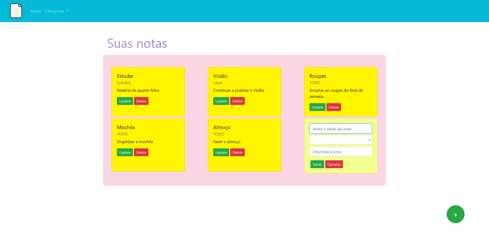
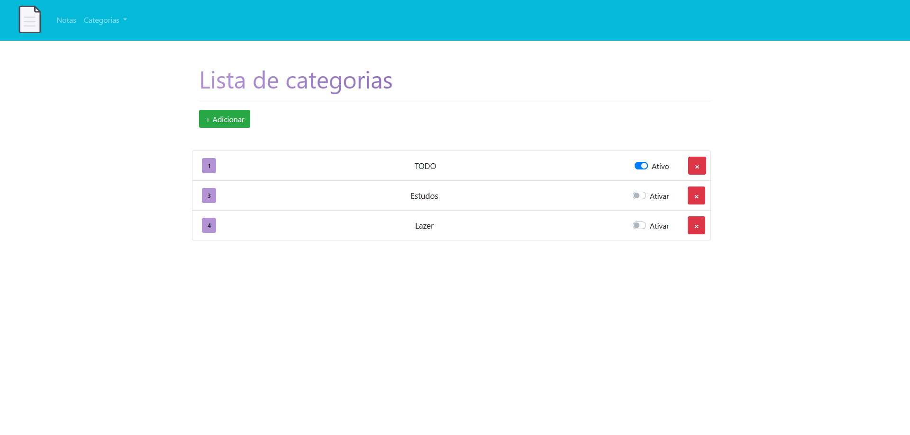
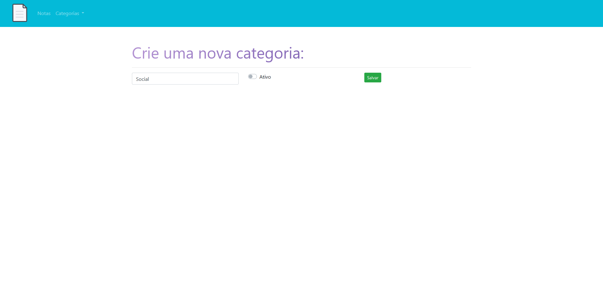
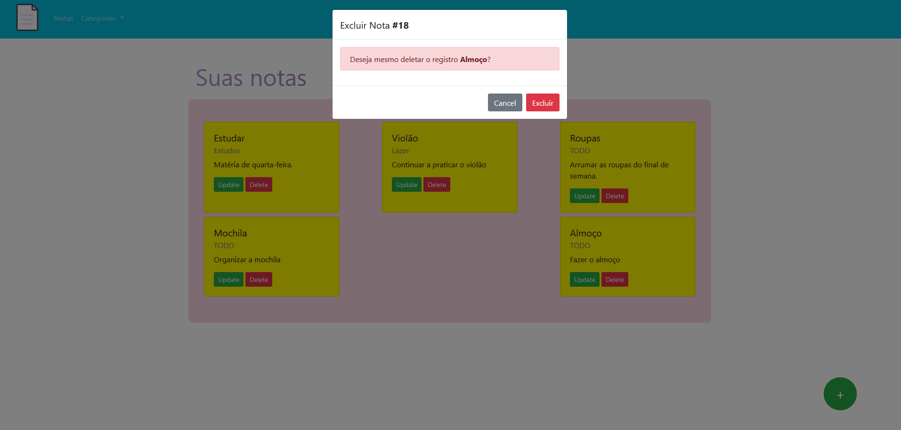

# Projeto Anotações

* Projeto de uma "agenda" onde pode-se adicionar anotações (notas) com categorias personalizadas.
* Back-end JAVA: SPRING BOOT OU QUARKUS, AMBOS FUNCIONAIS
* Banco de dados: MYSQL NO SPRING BOOT / POSTGRESQL NO DOCKER NO QUARKUS
* Front-end: Angular CLI 13

* Adicione categorias para poder adicionar notas. Você pode alterar as notas e excluí-las.
* Uma categoria pode ou não estar ativa.

* Preview:

